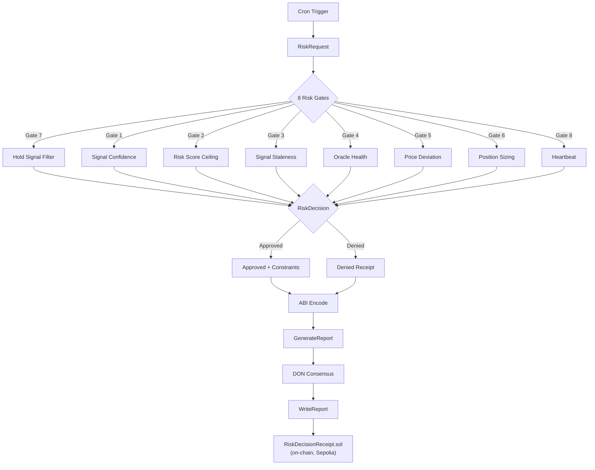

# CRE Risk Router

[](https://go.dev)
[](https://soliditylang.org)
[](https://chain.link)
[](https://sepolia.etherscan.io)
[](https://getfoundry.sh)

An **on-chain risk decision layer** for autonomous DeFi agents, built on the [Chainlink Runtime Environment (CRE)](https://chain.link). The Risk Router evaluates trade signals through **8 sequential risk gates** and writes immutable decision receipts to Ethereum via Chainlink DON consensus.

> **TL;DR** — An agent sends a trade signal. The Risk Router runs it through 8 gates (confidence, risk score, staleness, oracle health, price deviation, position sizing, heartbeat). If it passes, a constrained position is approved. The decision is ABI-encoded, signed by DON consensus, and written on-chain as an immutable receipt.

---

## Architecture



## Risk Gates

All gates run **sequentially** — the first denial short-circuits the pipeline.

| Gate | Name | Type | What It Does |
|:----:|------|:----:|-------------|
| 7 | Hold Signal Filter | **Deny** | Rejects `hold` signals immediately (fast-path) |
| 1 | Signal Confidence | **Deny** | Requires confidence >= threshold (default 0.6) |
| 2 | Risk Score Ceiling | **Deny** | Rejects scores above maximum (default 75) |
| 3 | Signal Staleness | **Deny** | Rejects signals older than TTL (default 300s) |
| 4 | Oracle Health | **Deny** | Validates Chainlink `latestRoundData()` 5-tuple |
| 5 | Price Deviation | **Deny** | Rejects if market vs oracle diverge > 500 BPS |
| 6 | Position Sizing | **Constrain** | Adjusts position based on volatility and risk score |
| 8 | Heartbeat | **Deny** | Circuit breaker for agent liveness (optional) |

## Prerequisites

| Tool | Version | Purpose |
|------|---------|---------|
| [Go](https://go.dev/dl/) | 1.25+ | Build WASM binary and bridge server |
| [CRE CLI](https://github.com/smartcontractkit/cre-cli) | latest | Simulate and deploy CRE workflows |
| [Foundry](https://getfoundry.sh) | latest | Compile and test Solidity contracts |
| [just](https://github.com/casey/just) | latest | Task runner (optional but recommended) |

## Quick Start

```bash
# 1. Clone and enter project
git clone https://github.com/lancekrogers/cre-risk-router.git
cd cre-risk-router

# 2. Install CRE CLI
go install github.com/smartcontractkit/cre-cli@latest

# 3. Login to CRE
cre auth login

# 4. Run simulation (dry-run, no on-chain write)
just simulate
# or without just:
cre workflow simulate . --non-interactive --trigger-index=0 --target=staging-settings
```

## Usage

### CRE Simulation

**Dry-run** (no on-chain transaction):
```bash
just simulate
```

**Broadcast** (writes receipt on-chain — requires `CRE_ETH_PRIVATE_KEY` in `.env`):
```bash
just broadcast
```

**E2E demo script:**
```bash
just demo                      # dry-run
./demo/e2e.sh --broadcast      # on-chain write
```

### HTTP Bridge

The bridge wraps the risk evaluation pipeline as an HTTP server for coordinator integration:

```bash
just bridge
```

**Endpoints:**

| Method | Path | Description |
|--------|------|-------------|
| `POST` | `/evaluate-risk` | Canonical risk evaluation endpoint |
| `POST` | `/evaluate` | Compatibility alias |
| `GET` | `/health` | Health check |

**Request body** (`POST /evaluate-risk`):

```json
{
  "agent_id": "agent-inference-001",
  "task_id": "task-001",
  "signal": "buy",
  "signal_confidence": 0.85,
  "risk_score": 10,
  "market_pair": "ETH/USD",
  "requested_position": 1000000000,
  "timestamp": 1740900000
}
```

**Response:**

```json
{
  "Approved": true,
  "ChainlinkPrice": 200000000000,
  "MaxPositionUSD": 810000000,
  "MaxSlippageBps": 500,
  "Reason": "approved",
  "TTLSeconds": 300
}
```

## Scenarios

Pre-built simulation scenarios in `scenarios/`:

| Scenario | Signal | Confidence | Risk | Expected |
|----------|:------:|:----------:|:----:|----------|
| `approved_trade.json` | buy | 0.85 | 10 | Approved, $810 constrained |
| `denied_low_confidence.json` | buy | 0.45 | 35 | Denied: confidence below threshold |
| `denied_high_risk.json` | sell | 0.90 | 82 | Denied: risk score exceeds max |
| `denied_stale_signal.json` | buy | 0.80 | 40 | Denied: signal expired |
| `denied_price_deviation.json` | buy | 0.85 | 20 | Denied: price deviation >5% |

## Configuration

Gate thresholds are defined in `config.staging.json` and `config.production.json`:

| Field | Default | Description |
|-------|:-------:|-------------|
| `signal_confidence_threshold` | `0.6` | Minimum signal confidence (0.0-1.0) |
| `max_risk_score` | `75` | Maximum allowed risk score (0-100) |
| `decision_ttl_seconds` | `300` | Signal freshness window |
| `price_deviation_max_bps` | `500` | Max oracle-market divergence (5%) |
| `volatility_scale_factor` | `1.0` | Position scaling sensitivity |
| `oracle_staleness_seconds` | `3600` | Max Chainlink feed age |
| `enable_heartbeat_gate` | `false` | Agent liveness check |

## Contract

**[`RiskDecisionReceipt.sol`](contracts/evm/src/RiskDecisionReceipt.sol)** deployed on Sepolia:

| | |
|---|---|
| **Address** | [`0xfcA344515D72a05232DF168C1eA13Be22383cCB6`](https://sepolia.etherscan.io/address/0xfcA344515D72a05232DF168C1eA13Be22383cCB6) |
| **Broadcast tx** | [`0xd8505ff...87360458`](https://sepolia.etherscan.io/tx/0xd8505ff76caa1e2d17b2ee49b625048f353359fabf68f02abedc9fda87360458) |

**Features:**
- `recordDecision()` — writes decision with duplicate prevention per `runId`
- `isDecisionValid()` — TTL-based expiry check
- `DecisionRecorded` event — for off-chain indexing
- On-chain approval/denial counters

## Project Structure

```
cre-risk-router/
├── main.go                    # WASM entrypoint (wasip1 build tag)
├── workflow.go                # CRE handlers (onScheduledSweep, executeRiskPipeline)
├── workflow_test.go           # CRE workflow tests
├── pkg/riskeval/
│   ├── types.go               # Config, RiskRequest, RiskDecision, MarketData, OracleData
│   ├── risk.go                # 8 risk gates + EvaluateRisk pipeline
│   ├── risk_test.go           # Gate unit tests
│   └── helpers.go             # keccak256 hashing, slippage, position math
├── cmd/bridge/
│   └── main.go                # HTTP bridge server for coordinator integration
├── contracts/evm/src/
│   ├── RiskDecisionReceipt.sol
│   ├── abi/                   # Contract ABI
│   └── generated/             # CRE-generated Go bindings
├── scenarios/                 # Pre-built simulation inputs
├── demo/e2e.sh                # End-to-end demo script
├── test/                      # Foundry tests
├── evidence/                  # Broadcast evidence (tx hashes, logs)
├── workflow.yaml              # CRE workflow settings
├── project.yaml               # RPC endpoints
├── config.staging.json        # Gate thresholds (staging)
├── config.production.json     # Gate thresholds (production)
├── justfile                   # Task runner recipes
└── foundry.toml               # Foundry configuration
```

## Just Recipes

All common operations are available via [`just`](https://github.com/casey/just):

```bash
just              # List all recipes
just install      # go mod tidy
just build        # Build WASM binary
just bridge       # Run HTTP bridge server
just simulate     # CRE dry-run simulation
just broadcast    # CRE on-chain broadcast
just test         # Run all tests (Go + Solidity)
just test-go      # Run Go tests only
just test-sol     # Run Solidity tests only
just lint         # go vet
just fmt          # gofmt
just bindings     # Generate EVM bindings from ABI
just forge-build  # Build Solidity contracts
just deploy       # Deploy contract to Sepolia
just demo         # Run e2e demo script
```

## Tech Stack

| Component | Technology |
|-----------|-----------|
| **Runtime** | Chainlink Runtime Environment (CRE) v1.2.0 |
| **Language** | Go (compiled to WASM via `wasip1`) |
| **Chain** | Ethereum Sepolia testnet |
| **Oracle** | Chainlink price feeds (`latestRoundData`) |
| **Contracts** | Solidity 0.8.x, Foundry |
| **Consensus** | CRE report-based DON consensus |
| **Bridge** | Go HTTP server (`net/http`) |

## Environment Variables

Copy `.env.example` to `.env` and configure:

```bash
DEPLOYER_PRIVATE_KEY=       # For forge create contract deployment
CRE_ETH_PRIVATE_KEY=        # For CRE broadcast (on-chain writes)
COINGECKO_API_KEY=           # Optional: market data for Gate 5
BRIDGE_ADDR=:8080            # Optional: bridge listen address
```

## License

MIT
